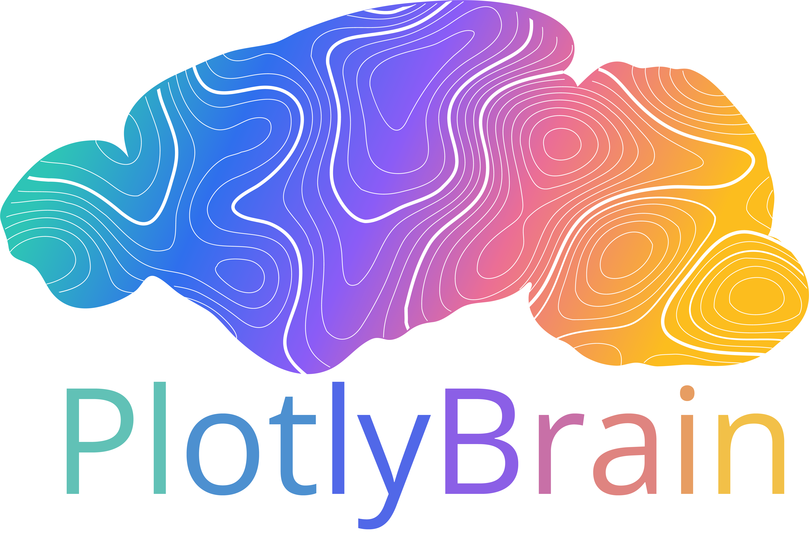

<div align="center">

<p align="center">
  
</p>

PlotlyBrain is an interactive Python framework for atlas-based visualization of quantitative histological data. It maps region-wise metrics derived from atlas-registered workflows (such as QUINT) onto the Allen Mouse Brain Common Coordinate Framework, combining measures of signal abundance and cross-animal consistency. Using a Plotly-based interface, PlotlyBrain enables dynamic exploration of brain-wide patterns across regions, rostro–caudal levels, experimental groups, and markers, while also supporting high-resolution static exports and 3D renderings. The framework is modular, marker-agnostic, and designed to improve the interpretability and accessibility of large-scale neuroanatomical datasets.  
</div>

## Installation

To install:

```
git clone https://github.com/anna-teruel/PlotlyBrain
cd PlotlyBrain
uv venv
.venv\Scripts\activate
uv pip install .
```