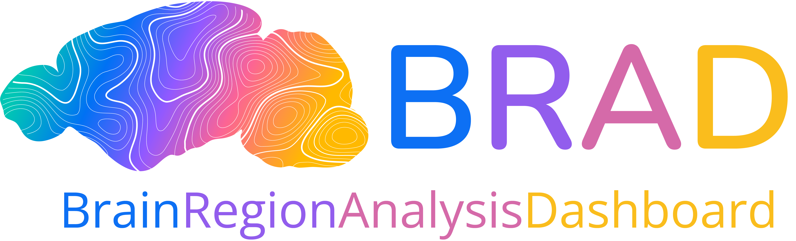

<div align="center">

<p align="center">
  
</p>
</div>

BRAD is an interactive Python framework for atlas-based visualization of quantitative histological data. It maps region-wise metrics derived from atlas-registered workflows (such as QUINT) onto the Allen Mouse Brain Common Coordinate Framework, combining measures of signal abundance and cross-animal consistency. Using a Plotly-based interface, BRAD enables dynamic exploration of brain-wide patterns across regions, rostro–caudal levels, experimental groups, and markers, while also supporting high-resolution static exports and 3D renderings. The framework is modular, marker-agnostic, and designed to improve the interpretability and accessibility of large-scale neuroanatomical datasets.  

## Installation

To install:

```
git clone https://github.com/anna-teruel/BRAD
cd BRAD
uv venv
.venv\Scripts\activate
uv pip install .
```

## Documentation

- [Using the dashboard](docs/dashboard_usage.md) — launching the app and the full workflow: load atlas, build slices, compute scores, view and export.
- [Filtering & coloring rendered slices](docs/filtering_and_coloring.md) — how to color regions by score, filter and select which regions stay highlighted, and apply a flat color.

## License

This project is licensed under the MIT License © 2026  
Anna Teruel-Sanchis and Konrad Danielewski.

See the [LICENSE](LICENSE) file for details.